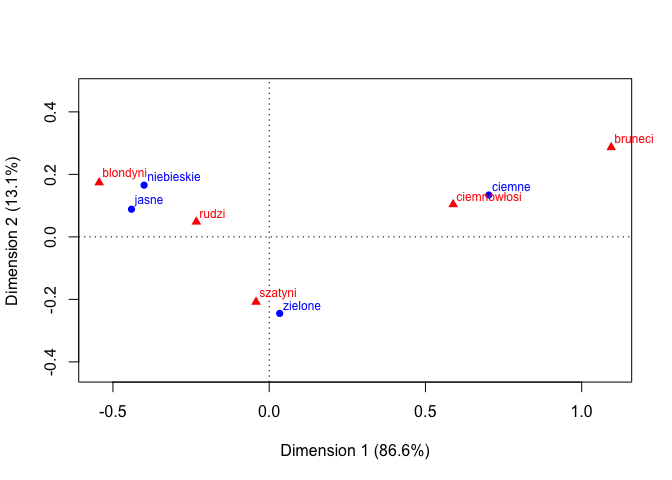
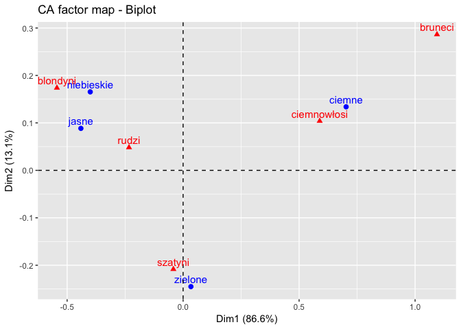
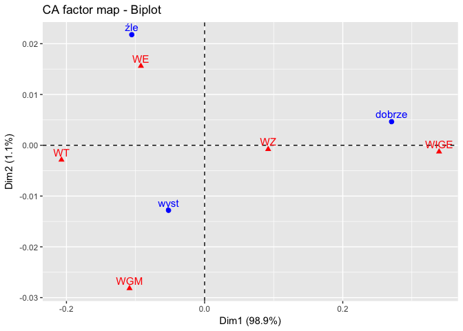

# Analiza korespondencji


```r
#install.packages(c('vcd','factoextra','ca')) 
library(ca) # pakiet do analizy korespondencji
library(vcd) # 
library(factoextra) # 
```

# Przeprowadzamy analizę korespondencji

Przykładowe dane


```r
dane <- matrix(c(326, 38, 241, 110, 3,
                 688, 116, 584, 188, 4,
                 343, 84, 909, 412, 26,
                 98, 48, 403, 681, 85),
               nrow = 4, ncol = 5, byrow = TRUE)

# Etykietyjemy wiersze

rownames(dane) <- c('niebieskie',
                    'jasne',
                    'zielone',
                    'ciemne')

# Etykietujemy kolumny

colnames(dane) <- c('blondyni',
                    'rudzi',
                    'szatyni',
                    'ciemnowłosi',
                    'bruneci')

print(dane)
```

```
##            blondyni rudzi szatyni ciemnowłosi bruneci
## niebieskie      326    38     241         110       3
## jasne           688   116     584         188       4
## zielone         343    84     909         412      26
## ciemne           98    48     403         681      85
```

```r
## badamy zależoność między zmiennymi
## funkcja pochodzi z pakietu vcd
assocstats(dane)
```

```
##                     X^2 df P(> X^2)
## Likelihood Ratio 1218.3 12        0
## Pearson          1240.0 12        0
## 
## Phi-Coefficient   : NA 
## Contingency Coeff.: 0.433 
## Cramer's V        : 0.277
```

Przeprowadzamy analizę korespondencji


```r
wynik <- ca(obj = dane)
summary(wynik)
```

```
## 
## Principal inertias (eigenvalues):
## 
##  dim    value      %   cum%   scree plot               
##  1      0.199245  86.6  86.6  **********************   
##  2      0.030087  13.1  99.6  ***                      
##  3      0.000859   0.4 100.0                           
##         -------- -----                                 
##  Total: 0.230191 100.0                                 
## 
## 
## Rows:
##     name   mass  qlt  inr    k=1 cor ctr    k=2 cor ctr  
## 1 | nbsk |  133  979  111 | -400 836 107 |  165 143 121 |
## 2 | jasn |  293  995  259 | -441 956 286 |   88  39  76 |
## 3 | ziln |  329  999   88 |   34  18   2 | -245 981 657 |
## 4 | cimn |  244 1000  543 |  703 965 605 |  134  35 145 |
## 
## Columns:
##     name   mass  qlt  inr    k=1 cor ctr    k=2 cor ctr  
## 1 | blnd |  270 1000  383 | -544 907 401 |  174  93 271 |
## 2 | rudz |   53  803   16 | -233 770  14 |   48  33   4 |
## 3 | szty |  397 1000   78 |  -42  39   4 | -208 961 572 |
## 4 | cmnw |  258 1000  401 |  589 969 449 |  104  30  93 |
## 5 | brnc |   22  998  122 | 1094 934 132 |  286  64  60 |
```

```r
plot(wynik)
```

<!-- -->

```r
fviz_ca(wynik) ## wizualizacja wyników z pakietem ggplot2
```

<!-- -->

# Analiza korespondencji w badaniu KdG

Wybieramy dwie zmienne dla roku 2011

1. Ukończony wydział na I stopniu (wydzial1)
2. Jaką minimalną płacę był(a)byś w stanie zaakceptować (lub zaakceptowałaś/-eś) podejmując stałą pracę? (płaca)


```r
load('../../Analiza KdG/datasets/bkl_2011_2013.RData')
do_tabeli <- subset(x = dane[[1]],
                    select = c(wydzial1,p13,w,wydzial2),
                    subset = wydzial1 != 6)

xtabs(~p13 + wydzial1, do_tabeli) 
```

```
##    wydzial1
## p13   1   2   3   4   5
##   1  10   1   3   1   8
##   2  83  42  11  16  79
##   3 179  96  33  32 179
##   4  50  23  18   6  77
##   5   8   4   8   1  10
```

```r
## w zbiorze znajdują się puste kategorie, należy dane zagregować

do_tabeli$p13 <- ifelse(do_tabeli$p13 %in% 1:2, 2, do_tabeli$p13)
do_tabeli$p13 <- ifelse(do_tabeli$p13 %in% 4:5, 4, do_tabeli$p13)

do_analizy <- aggregate(formula = w ~ p13 + wydzial1, data = do_tabeli, FUN = sum)

tabela <- xtabs(w ~ p13 + wydzial1, data = do_analizy)
rownames(tabela) <- c('źle','wyst','dobrze')
colnames(tabela) <- c('WE','WGM','WIGE','WT','WZ')
print(tabela)
```

```
##         wydzial1
## p13              WE        WGM       WIGE         WT         WZ
##   źle    137.827414  65.386565  22.303563  22.363413 123.991743
##   wyst   255.002524 132.544457  52.047963  41.506280 255.280286
##   dobrze  80.417332  37.842960  38.481263   8.944957 121.325467
```

```r
summary(tabela) 
```

```
## Call: xtabs(formula = w ~ p13 + wydzial1, data = do_analizy)
## Number of cases in table: 1395.266 
## Number of factors: 2 
## Test for independence of all factors:
## 	Chisq = 27.477, df = 8, p-value = 0.0005846
```

```r
assocstats(tabela) ## jest zależność, zobaczmy jaka
```

```
##                     X^2 df   P(> X^2)
## Likelihood Ratio 26.603  8 0.00082780
## Pearson          27.477  8 0.00058463
## 
## Phi-Coefficient   : NA 
## Contingency Coeff.: 0.139 
## Cramer's V        : 0.099
```

```r
### przeprowadzamy analizę korespondencji

analiza_kdf <- ca(obj = tabela)
summary(analiza_kdf)
```

```
## 
## Principal inertias (eigenvalues):
## 
##  dim    value      %   cum%   scree plot               
##  1      0.019475  98.9  98.9  *************************
##  2      0.000218   1.1 100.0                           
##         -------- -----                                 
##  Total: 0.019693 100.0                                 
## 
## 
## Rows:
##     name   mass  qlt  inr    k=1  cor ctr    k=2 cor ctr  
## 1 |  źle |  267 1000  157 | -105  959 152 |   22  41 581 |
## 2 | wyst |  528 1000   78 |  -52  943  74 |  -13  57 398 |
## 3 | dbrz |  206 1000  766 |  271 1000 774 |    5   0  20 |
## 
## Columns:
##     name   mass  qlt  inr    k=1  cor ctr    k=2 cor ctr  
## 1 |   WE |  339 1000  151 |  -92  972 148 |   16  28 380 |
## 2 |  WGM |  169 1000  108 | -109  937 103 |  -28  63 617 |
## 3 | WIGE |   81 1000  473 |  339 1000 478 |   -1   0   1 |
## 4 |   WT |   52 1000  114 | -207 1000 115 |   -3   0   2 |
## 5 |   WZ |  359 1000  154 |   92 1000 156 |   -1   0   1 |
```

```r
### wizualizacja z ggplot2
fviz_ca(analiza_kdf)
```

<!-- -->

```r
statystyki_wiersze <- get_ca_row(analiza_kdf)
statystyki_kolumny <- get_ca_col(analiza_kdf)

### udziały w tworzeniu wymiarów
statystyki_wiersze$contrib
```

```
##            Dim.1     Dim.2
## źle    15.217926 58.129619
## wyst    7.397101 39.825765
## dobrze 77.384973  2.044616
```

```r
statystyki_kolumny$contrib
```

```
##         Dim.1       Dim.2
## WE   14.80784 37.97517085
## WGM  10.25327 61.66783753
## WIGE 47.83935  0.05919258
## WT   11.50532  0.19690071
## WZ   15.59422  0.10089833
```


# Źródła informacji (wybrane)

http://www.sthda.com/english/wiki/correspondence-analysis-in-r-the-ultimate-guide-for-the-analysis-the-visualization-and-the-interpretation-r-software-and-data-mining


https://journal.r-project.org/archive/accepted/lombardo-beh.pdf

